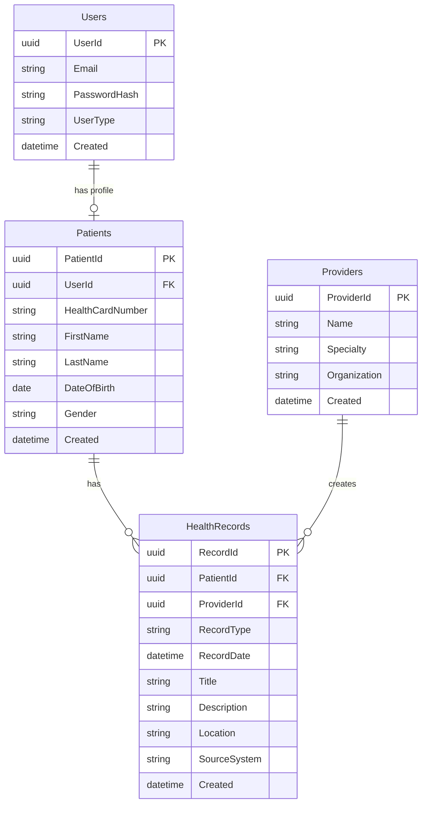

# HealthBridge
 
## Connecting Canada's Health Information
 
HealthBridge is a patient-centric health information platform that addresses fragmentation in Canadian healthcare records by creating a secure, unified timeline of a patient's complete medical history. The solution aligns with the Connected Care for Canadians Act and empowers patients with control over their health information.
 
## Table of Contents
 
- [Overview](#overview)
- [Key Features](#key-features)
- [Technology Stack](#technology-stack)
- [Project Structure](#project-structure)
- [Setup Instructions](#setup-instructions)
- [Database Schema](#database-schema)
- [Development Workflow](#development-workflow)
- [Future Roadmap](#future-roadmap)
- [Team](#team)
- [License](#license)
 
## Overview
 
HealthBridge addresses a critical gap in Canada's healthcare infrastructure: the lack of seamless information flow between different providers, facilities, and patients themselves. By creating a secure bridge between existing health information systems, HealthBridge aims to reduce redundant tests, prevent medication errors, improve care coordination, and empower patients to participate more actively in their healthcare decisions.
 
This project directly aligns with the Connected Care for Canadians Act (introduced June 2024), which creates both the regulatory permission and policy momentum for digital solutions that facilitate health information sharing.
 
## Key Features
 
### Unified Health Timeline
- Chronological display of all health events
- Color-coded categorization by record type (consultations, tests, procedures, prescriptions)
- Comprehensive record details including provider, location, and description
- Filtering and search capabilities
 
### Multi-Source Data Integration
- Aggregation of records from different healthcare providers
- Consistent formatting of data from varied sources
- Source attribution for each record
- Simulated integration with multiple healthcare systems
 
### Patient Profile Management
- Basic demographic information
- Health card details
- Authentication and secure access
 
### Provider Information
- Provider details linked to health records
- Organization and specialty information
- Attribution of records to specific providers
 
## Technology Stack
 
### Backend
- **Framework**: ASP.NET Core MVC 7.0
- **Language**: C#
- **ORM**: Entity Framework Core
- **Database**: SQL Server
- **Authentication**: ASP.NET Core Identity
 
### Frontend
- **Framework**: React.js
- **State Management**: React Context API
- **UI Components**: Material UI or Bootstrap
- **HTTP Client**: Axios
 
### Development Tools
- **IDE**: Visual Studio 2022
- **Version Control**: Git
- **Package Manager**: NuGet (backend), npm (frontend)
- **API Testing**: Postman or Swagger UI
 
## Project Structure
 
HEALTHBRIDGE_TECHCRUSADERS/
│
├── Controllers/
│   ├── HomeController.cs              # Landing page controller
│   ├── PatientController.cs           # Patient profile and dashboard
│   ├── HealthRecordController.cs      # Health record management
│   ├── AccountController.cs           # Authentication and user management
│   └── ErrorController.cs             # Error handling
│
├── Models/
│   ├── HealthRecord.cs                # Health record entity
│   ├── Patient.cs                     # Patient profile entity
│   ├── Provider.cs                    # Healthcare provider entity
│   ├── User.cs                        # User authentication entity
│   └── ErrorViewModel.cs              # Error display model
│
├── Data/
│   ├── HealthBridgeDbContext.cs       # Entity Framework DbContext
│   ├── Repositories/
│   │   ├── PatientRepository.cs       # Patient data access
│   │   ├── HealthRecordRepository.cs  # Health record data access
│   │   ├── ProviderRepository.cs      # Provider data access
│   │   └── IRepository.cs             # Repository interface
│   ├── SeedData.cs                    # Database seed data
│   └── Migrations/                    # EF Core migrations
│
├── Services/
│   ├── AuthService.cs                 # Authentication logic
│   ├── PatientService.cs              # Patient business logic
│   ├── TimelineService.cs             # Timeline generation logic
│   └── Interfaces/
│       ├── IAuthService.cs
│       ├── IPatientService.cs
│       └── ITimelineService.cs
│
├── Views/
│   ├── Home/
│   │   ├── Index.cshtml               # Landing page
│   │   └── Privacy.cshtml             # Privacy policy
│   │
│   ├── Patient/
│   │   ├── Dashboard.cshtml           # Patient dashboard
│   │   └── Profile.cshtml             # Edit profile
│   │
│   ├── Shared/
│   │   ├── _Layout.cshtml             # Main layout
│   │   ├── _ValidationScriptsPartial.cshtml
│   │   └── Error.cshtml               # Error page
│   │
│   ├── _ViewStart.cshtml
│   └── _ViewImports.cshtml
│
├── wwwroot/
│   ├── css/
│   │   ├── site.css
│   │   └── _Layout.cshtml.css
│   │
│   ├── js/
│   │   ├── site.js                    # Common JavaScript
│   │   └── timeline.js                # Timeline visualization
│   │
│   ├── lib/                           # Third-party libraries
│   └── images/
│
├── Properties/
│   └── launchSettings.json            # Development server settings
│
├── Program.cs                         # Application entry point
├── appsettings.json                   # Application configuration
└── appsettings.Development.json       # Development configuration
 
## Setup Instructions
 
### Prerequisites
- [Visual Studio 2022](https://visualstudio.microsoft.com/vs/) (Community edition or higher)
- [SQL Server](https://www.microsoft.com/en-us/sql-server/sql-server-downloads) (Express edition or higher)
- [.NET 7.0 SDK](https://dotnet.microsoft.com/download/dotnet/7.0)
- [Node.js](https://nodejs.org/) (v16 or higher) and npm
- [Git](https://git-scm.com/)
 
### Backend Setup
 
1. Clone the repository
   ```
   git clone https://github.com/raman-dxxp/HealthBridge_TechCursaders
   ```
 
2. Open the solution in Visual Studio 2022
 
 
3. Update the connection string in `appsettings.json` files in both the HealthBridge.API and HealthBridge.Web projects
   ```json
   "ConnectionStrings": {
     "DefaultConnection": "Server=(localdb)\\mssqllocaldb;Database=HealthBridge;Trusted_Connection=True;MultipleActiveResultSets=true"
   }
   ```
 
4. Apply database migrations using Package Manager Console
   ```
   Update-Database -Project HealthBridge.Infrastructure -StartupProject HealthBridge.API
   ```
 
5. Seed the database with demo data
   ```
   dotnet run --project src/HealthBridge.Infrastructure/Tools/DataSeeder
   ```
 
6. Set HealthBridge.API as the startup project and run the application
   ```
   dotnet run --project src/HealthBridge.API
   ```
 
## Database Schema
 

## Future Roadmap
 
### Phase 2: Provider Portal
- Provider authentication and verification
- Patient record access with permission controls
- Record creation and update capabilities
- Inter-provider communication
 
### Phase 3: Advanced Sharing
- Granular permission controls for patients
- Temporary access grants
- Emergency access features
- QR code-based record sharing
 
### Phase 4: Health Data Intelligence
- Medical terminology conversion to plain language
- Visual representation of test results and trends
- Predictive analytics for health outcomes
- Medication interaction checking
 
## Team
 
- [Yipeng Huang]
- [Nanmi Zimik]
- [Ramandeep]
- [Amandeep]
 
## License
 
This project is licensed under the [MIT License](LICENSE).
 
---
 
Developed for the Canadian Healthcare Innovation Challenge, 2025.